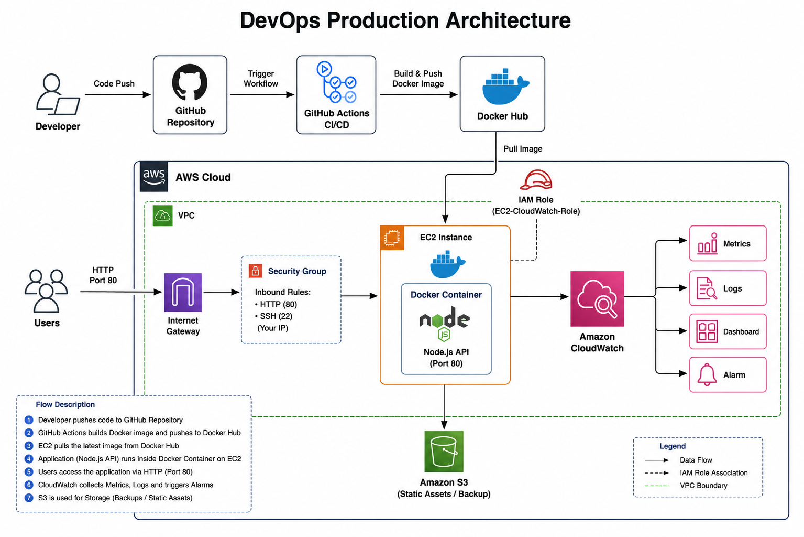

# 🚀 AWS DevOps Production Deployment Pipeline

A production-style DevOps project demonstrating automated CI/CD deployment of a Dockerized Node.js application on AWS EC2 using GitHub Actions, Docker Hub, Amazon CloudWatch, Amazon S3, and Load Testing with k6.

---

# 📌 Project Overview

This project demonstrates an end-to-end DevOps workflow from source code management to automated deployment and monitoring.

Whenever code is pushed to the **main** branch:

- GitHub Actions automatically builds the Docker image
- Pushes the image to Docker Hub
- Connects to AWS EC2
- Pulls the latest Docker image
- Deploys the updated application
- CloudWatch monitors infrastructure and application logs

---

# 🏗 Architecture

> Add your architecture image below.



# ✨ Features

- Automated CI/CD using GitHub Actions
- Dockerized Node.js API
- Automatic deployment to AWS EC2
- Docker Hub integration
- Amazon S3 backup
- Amazon CloudWatch Dashboard
- CloudWatch Alarms
- CloudWatch Logs
- Load Testing using k6
- Security Best Practices
- Complete Deployment Documentation

---

# 🛠 Technologies Used

| Category | Technologies |
|-----------|-------------|
| Cloud | AWS EC2, S3, IAM, CloudWatch |
| Containerization | Docker |
| CI/CD | GitHub Actions |
| Source Control | Git & GitHub |
| Language | Node.js |
| Testing | k6 |
| Monitoring | CloudWatch |
| OS | Ubuntu Linux |

---

# 📂 Project Structure

```text
aws-devops-production-deployment/
│
├── .github/
│   └── workflows/
│       └── deploy.yml
│
├── app/
│   ├── app.js
│   ├── Dockerfile
│   ├── package.json
│   ├── package-lock.json
│   └── .dockerignore
│
├── architecture/
│
├── docs/
│   ├── DEPLOYMENT.md
│   └── SECURITY.md
│
├── k6/
│   └── load-test.js
│
├── screenshots/
│
├── scripts/
│   └── deploy.sh
│
├── README.md
│
└── .gitignore
```

---

# ⚙ CI/CD Workflow

```
Developer
      │
      ▼
GitHub Repository
      │
      ▼
GitHub Actions
      │
      ▼
Build Docker Image
      │
      ▼
Push to Docker Hub
      │
      ▼
SSH into EC2
      │
      ▼
Pull Latest Image
      │
      ▼
Run Docker Container
      │
      ▼
Application Live
      │
      ▼
CloudWatch Monitoring
```

---

# 🚀 Deployment Steps

## Clone Repository

```bash
git clone https://github.com/Methx17/aws-devops-production-deployment.git
cd aws-devops-production-deployment
```

## Configure GitHub Secrets

Configure:

- DOCKER_USERNAME
- DOCKER_PASSWORD
- EC2_HOST
- EC2_USERNAME
- EC2_SSH_KEY

## Push Code

```bash
git add .
git commit -m "Deploy application"
git push origin main
```

GitHub Actions automatically deploys the latest version to AWS EC2.

---

# 📊 Monitoring

This project uses Amazon CloudWatch for:

- CPU Utilization
- Memory Utilization
- Disk Utilization
- CloudWatch Dashboard
- CloudWatch Alarms
- Centralized Application Logs

---

# 📈 Load Testing

Load testing is performed using **k6**.

Metrics monitored include:

- Response Time
- Throughput
- Error Rate
- CPU Usage
- Memory Usage

---

# 🔐 Security

Implemented security best practices:

- IAM Role with least privilege
- SSH Key Authentication
- GitHub Secrets
- Security Groups
- Docker Image Isolation
- CloudWatch Monitoring

---

# 📸 Screenshots

The project includes screenshots for:

- AWS EC2
- GitHub Actions
- Docker Hub
- CloudWatch Dashboard
- CloudWatch Logs
- Load Testing
- CI/CD Pipeline

All screenshots are available in the **screenshots/** folder.

---

# 📄 Documentation

Additional documentation:

- docs/DEPLOYMENT.md
- docs/SECURITY.md

---

# 🚧 Future Improvements

- HTTPS using Nginx & Let's Encrypt
- Terraform Infrastructure as Code
- Kubernetes Deployment
- Jenkins Pipeline
- Prometheus Monitoring
- Grafana Dashboards

---

# 👨‍💻 Author

**Methesh Shetty**

GitHub:
https://github.com/Methx17

LinkedIn:
https://www.linkedin.com/in/methesh-shetty

---

# ⭐ If you found this project useful

Please consider giving this repository a ⭐ on GitHub.